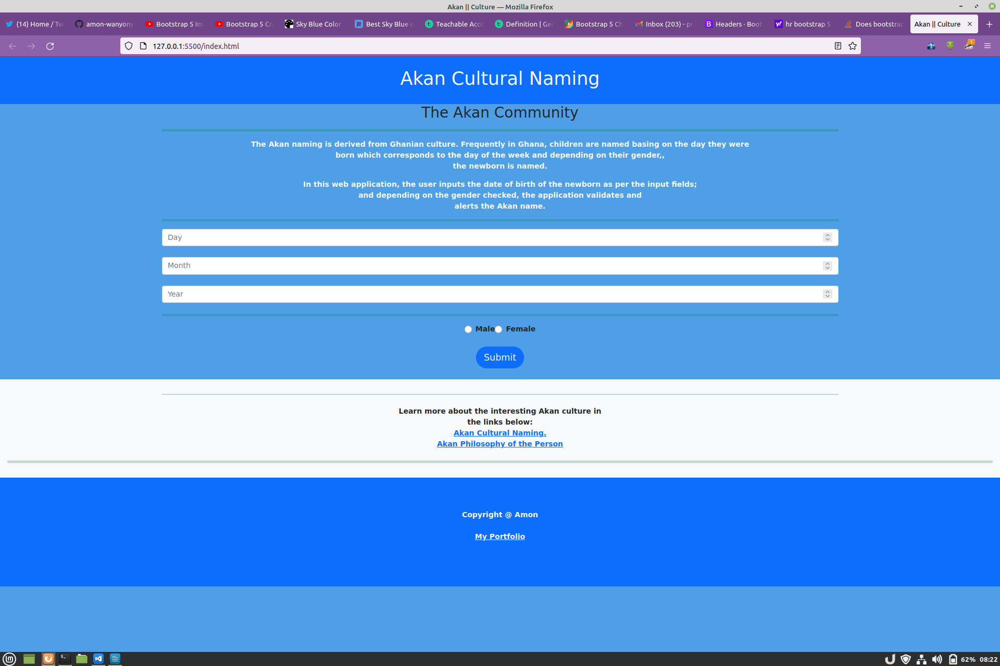

# AKAN NAMES
## Author: Amon Wanyonyi
## Description
###### The web application takes the user's inputs - date of birth as per the input fields, and depending   on the checked gender, alerts the newborn's name.

### Technologies used:

> - Bootstrap version 5
> - JavaScript
> - CSS
> - HTML

## Setup Instructios
###### Download of git clone the repository
###### To git clone, Copy the repository URL
###### Open the terminal 
###### Change the directory to the location you want
###### Type git clone, paste the URL you copies and hit enter

## Contact Information
###### For more information and questions, feel free to contact me through this mail   xxx110680@gmail.com or mc.max.aw@gmail.com

## License
###### [MIT] Lisence Copyright (c) 2021